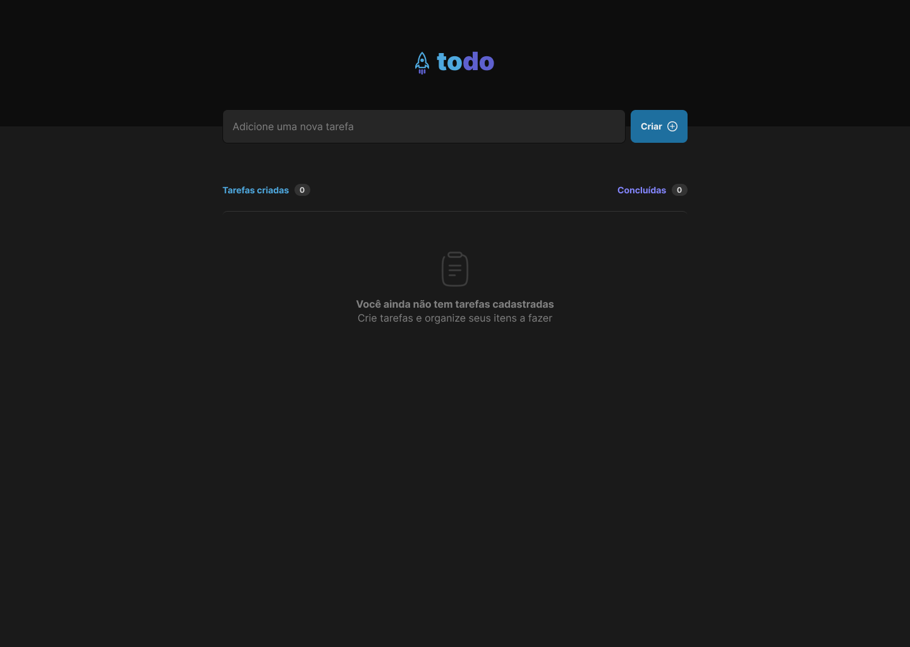

<div align="center">
  
  <h3>Todo List desenvolvida para o bootcamp ignite da rocketseat</h3>
</div>

## 📃 Sobre

<br />

Este 

## 💻 Principais Tecnologias utilizadas no projeto

Por ser um projeto simples e pequeno este projeto não necessita de muitas bibliotecas para que possa ser desenvolvido. abaixo você pode ver quais são dependências dessa todo list.

- [Vite](https://vitejs.dev/)
- [React](https://pt-br.reactjs.org/)
- [Typescript](https://www.typescript)
- [Phosphor-icons](https://phosphoricons.com/)
- [Uuid](https://www.npmjs.com/package/uuid)

## Funcionalidades

Este projeto possui algumas funcionalidades bem legais que ajudam muito os iniciantes no desenvolvimento web com react. as funcionalidades são:

- Adicionar uma nova tarefa

- Marcar e desmarcar uma tarefa como concluída

- Remover uma tarefa da listagem

- Mostrar o progresso de conclusão das tarefas

## Como executar o projeto na sua máquina

<br />

Para executar o projeto você terá de seguir os passos listados abaixo. 

Primeiro clone o repositório do projeto com o comando:

<br />

```bash
git clone git@github.com:henrique998/Rocket-Todo.git
```

Execute um dos comando abaixo para instalar as dependências do projeto:

```bash
npm install
# OU
yarn install
```

<br />

Agora está tudo pronto para iniciar o projeto. execute o comando abaixo para iniciar o servidor:

<br />

```bash
npm run dev
# OU
yarn dev
```

## Contato

<br />

Entre em contato comigo por email ou no linkedin:

- henriquemonteiro037@gmail.com
- [linkedin](https://www.linkedin.com/in/henrique-monteiro1/)